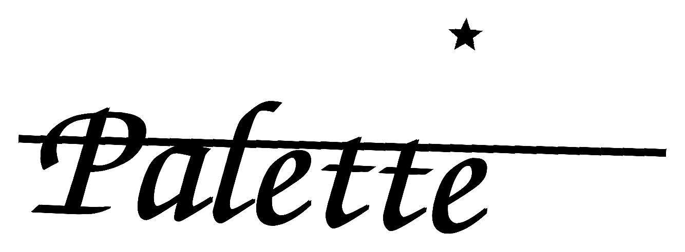
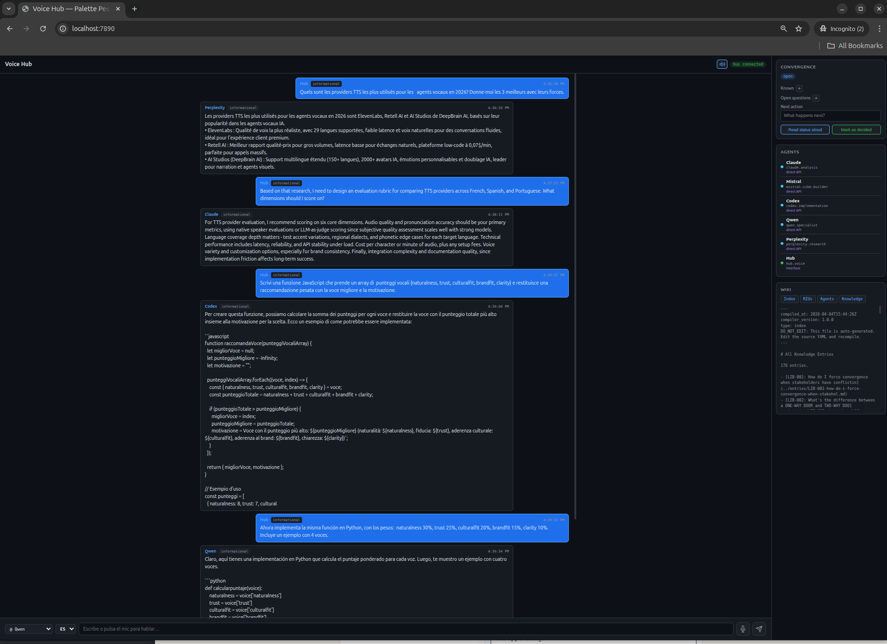

<div align="center">


<br>
<sup>™</sup>

### A Knowledge Architecture for AI Competency, Assessment & Enablement

A governed system that maps enterprise AI problems to competency areas, structures knowledge with evidence tiers and learning progressions, evaluates understanding through AI-augmented assessment, and scales through intelligent automation — not headcount.

---

[]()
[]()
[]()
[]()
[]()
[]()
[]()

</div>

---

## What Is Palette?

Palette is a knowledge architecture that maps 121 enterprise AI competency areas across 6 structured data layers, maintains a 176-entry sourced knowledge library with evidence tiers and learning progressions, and evaluates understanding through governed assessment tooling. It was distilled from 8 years of knowledge engineering and 250+ enterprise enablement sessions — real questions from real practitioners — then systematically refined, source-verified, and indexed.

**The thesis**: competency in AI is not a binary. It's a progression — foundation → retrieval → orchestration → specialization — and each stage requires different knowledge, different assessment, and different tooling. Palette structures that progression and scales it through intelligent automation.

### Key Capabilities

- **Competency Taxonomy** — 121 validated problem-solution nodes (RIUs) mapping enterprise AI challenges to measurable skill areas, with maturity classification (UNVALIDATED → WORKING → PRODUCTION)
- **Knowledge Library** — 176 entries with sourced evidence tiers (Tier 1: Google/Anthropic/OpenAI/AWS; Tier 2: NIST/peer-reviewed; Tier 3: validated open-source) and learning progressions
- **Assessment & Governance** — Every decision classified as `ship` / `ship_with_risks` / `ship_with_convergence` / `block` with explicit ONE-WAY DOOR / TWO-WAY DOOR reversibility gates
- **Multi-Agent Evaluation** — 12 specialized agents with promotion/demotion logic, quality gates, GO/NO-GO verdicts, and automated integrity checks
- **Integrity Engine** — 8 consistency checks across 6 data layers, catching structural gaps, regressions, and terminology drift in real time
- **Skills** — 6 validated domain frameworks (retail-ai, talent, education, travel, enablement, lenses) applied through real implementations

---

## Voice & Multilingual Agent Design

Palette includes specialized tooling for multilingual voice agent evaluation, multi-agent voice coordination, and speech synthesis integration.

### [Voice Evaluation Workbench](voice/workbench/) — [Live Demo](https://pretendhome.github.io/palette/voice-workbench/)
A multilingual tool for comparing, scoring, and choosing AI agent voices across customer journey stages (Acceptance, Resolution, Satisfaction). Structured rubric (Naturalness, Trust, Cultural Fit, Brand Fit, Clarity), weighted scoring, TTFA measurement, locale-specific watchouts, and exportable decision scorecards. 4 languages, native-speaker voices per language, 3 journey stages.

### [Voice Hub](peers/hub/) — Multi-Agent Voice Interface
A voice-first interface connecting 5 LLM agents (Claude, Mistral, GPT, Qwen, Perplexity) through voice in 4 languages. Rime Arcana v2 TTS with sentence-boundary streaming, Whisper local STT, and every voice query classified through the 121-node RIU taxonomy before grounding the response in the knowledge library. Governed message bus with risk gates and human checkpoints.


*Research (FR/Perplexity) → Design (EN/Claude) → Build (IT/Codex) → Implement (ES/Qwen) — four agents, four languages, one workflow.*

---

## System Summary

<div align="center">

| Component | Specification |
|:--|:--|
| Competency Areas (RIUs) | 121 (81 internal, 40 service-routed) |
| Knowledge Entries | 176 with verified source citations and evidence tiers |
| Integration Recipes | 75 (auth, endpoints, cost, quality tier) |
| Service Routing | 106 services across 40 routing profiles |
| People Signals | 21 profiles, 33 tools tracked |
| Override Registry | 19 explicit mappings for ambiguous cases |
| Agents | 12 specialized (resolver, researcher, architect, builder, debugger, narrator, validator, monitor, orchestrator, business-plan-creation, health, total-health) |
| Skills | 6 domains (retail-ai, talent, education, travel, enablement, lenses) |
| Active Projects | 9 (retail, talent, education, finance, dev) |

</div>

---

## Architecture

```
┌─────────────────────────────────────────────────────────────┐
│                     Natural Language In                       │
├─────────────────────────────────────────────────────────────┤
│  Resolver  →  Coordination Pipeline  →  Traverse     │
│                                                              │
│  ┌─────────────────────────────────────────────────────┐    │
│  │  6 Data Layers                                       │    │
│  │  ┌──────────┐ ┌──────────┐ ┌──────────┐            │    │
│  │  │Taxonomy  │ │Routing   │ │Recipes   │            │    │
│  │  │121 RIUs  │ │106 svcs  │ │69 specs  │            │    │
│  │  └──────────┘ └──────────┘ └──────────┘            │    │
│  │  ┌──────────┐ ┌──────────┐ ┌──────────┐            │    │
│  │  │Knowledge │ │Signals   │ │Overrides │            │    │
│  │  │176 entries│ │21 people │ │19 maps   │            │    │
│  │  └──────────┘ └──────────┘ └──────────┘            │    │
│  └─────────────────────────────────────────────────────┘    │
│                                                              │
│  ┌─────────────────────────────────────────────────────┐    │
│  │  Integrity Layer                                     │    │
│  │  Integrity → Audit → Regression → Drift → Monitor      │    │
│  │  8/8 checks   1 finding  7/7 SLOs   15 clusters     │    │
│  └─────────────────────────────────────────────────────┘    │
├─────────────────────────────────────────────────────────────┤
│                    Governed Action Out                        │
│         ship │ ship_with_risks │ ship_with_convergence │ block│
└─────────────────────────────────────────────────────────────┘
```

### Three Tiers

**Tier 1: Core Governance** — Immutable rules. Convergence before execution, glass-box reasoning, ONE-WAY DOOR (irreversible, requires human review) vs TWO-WAY DOOR (reversible, can proceed) classification.

**Tier 2: Agent Maturity** — 12 specialized agents that earn autonomy through measured performance. UNVALIDATED → WORKING → PRODUCTION. Automatic demotion on repeated failures. This is a competency framework applied to AI agents themselves.

**Tier 3: Integrity & Assessment** — Structural proof that the system is healthy. Consistency checks, audit findings, regression detection, SLO enforcement, terminology drift tracking. The integrity engine is the assessment layer — it evaluates whether knowledge is current, complete, and internally consistent.

---

## Current Status

<div align="center">

| Metric | Value | Threshold |
|:--|:--|:--|
| Consistency checks | **8/8 passing** | 8/8 |
| SLO compliance | **7/7 passing** | 7/7 |
| Regressions | **0** | 0 |
| Improvements tracked | **44** | — |
| Audit findings | **1** (medium, non-blocking) | 0 critical |
| Risk score | **2** (down from 14) | — |
| Avg completeness | **81.8/100** | ≥ 40 |
| Routing↔Recipe match | **106/106** | ≥ 95% |
| Knowledge coverage | **176/176** (100%) | ≥ 50% |
| Terminology drift clusters | **15** (3 high, 9 medium, 3 low) | — |
| Traverse health | **121/121 healthy** | — |

</div>

---

## Verified Operational State

The following is verified in the current repo as of 2026-04-04:

- `scripts/compile_wiki.py` and `scripts/validate_wiki.py` are operational. Validation passes `8/8`, and a deterministic rebuild produces 337 wiki pages from the live source data.
- The wiki governance pipeline is operational at the script level: `scripts/file_proposal.py`, `scripts/record_vote.py`, `scripts/promote_proposal.py`, and `scripts/bridge_feedback_to_proposals.py` are present and both governance health sections are green.
- `scripts/voice_interface.py` is wired to the real Palette peers bus at `127.0.0.1:7899`. It supports dry runs, live bus broadcasts, metrics/history persistence, and broker-level delivery confirmation.

The following are intentionally not claimed here:

- production readiness
- per-agent acknowledgment semantics beyond confirmed bus delivery and fetched messages
- a pristine release worktree

Palette currently has operational V3 infrastructure, but it still needs maintenance discipline and final semantic review before it should be described as release-clean.

---

## Traverse Engine

The traverse engine queries any competency area and returns a structured assessment packet — recommendation, alternatives, cost data, knowledge citations, and completeness score:

```
$ python3 -c "
from scripts.palette_intelligence_system.loader import load_all
from scripts.palette_intelligence_system.traverse import traverse
r = traverse(load_all(), riu_id='RIU-082')
"

RIU: RIU-082 — LLM Safety Guardrails (Content + Tool Use)
Classification: both
Recommendation: AWS Bedrock Guardrails
  Quality: tier_1 | Cost: PII + word filters FREE. Content: $0.15/1K units.
  Integration: available | Recipe: True
Alternatives:
  - Lakera Guard (tier_1, free 10K req/month, Pro $99/month)
  - Guardrails AI (tier_1, OSS free, Pro ~$50/month)
Knowledge support: 9 entries
Completeness: 85/100
Health: ok
```

Every service-routed competency area (40/40) returns a recommendation with alternatives, cost data, and evidence citations.

---

## Integrity Engine

The integrity engine is the write path — structural proof that the system is healthy.

```bash
# Consistency checks
python3 -m scripts.palette_intelligence_system.integrity --checks-only

# Audit with severity ranking
python3 -m scripts.palette_intelligence_system.audit_system

# Regression check against baseline
python3 -m scripts.palette_intelligence_system.regression --check

# Terminology drift detection
python3 -m scripts.palette_intelligence_system.drift

# Governance decision
python3 -m scripts.palette_intelligence_system.para_decision
```

The Monitor decision engine chains all four checks and outputs a governed decision:

```
Decision: ship_with_risks
Accepted risks:
  - LINK_MISSING_PEOPLE_SIGNALS: 28 RIUs without people signal coverage
Required actions:
  - Expand people signal crossrefs for uncovered both-classified RIUs
```

---

## Agents

| Agent | Role | Specialty |
|:--|:--|:--|
| **Resolver** | Intent Resolution | Maps input to RIU, asks clarifying questions |
| **Researcher** | Research | Check internal libraries first, then Perplexity Sonar API |
| **Architect** | Architecture | Design with explicit tradeoff clarity |
| **Builder** | Build | Scope-bounded implementation |
| **Debugger** | Debug | Root cause analysis, fix verification |
| **Narrator** | Narrative | Evidence-based GTM, no speculation |
| **Validator** | Validation | Quality gates, GO/NO-GO verdicts |
| **Monitor** | Monitoring | Governance decisions, block routing |
| **Orchestrator** | Workflow | Routes between agents, manages relay |
| **Business Plan** | Planning | Multi-agent business plan workflow |
| **Health** | Integrity | System-wide health checklist, 8 sections |
| **Total Health** | Deep Audit | Cross-layer integrity, identity coherence, 13 sections |

**Maturity Model**: Agents earn trust through performance.
- **UNVALIDATED** → 10 successes → **WORKING** → 50 runs <5% fail → **PRODUCTION**
- 2 failures in 10 runs → automatic demotion

**Block Routing**: When Monitor blocks a decision, it routes to the right agent:
- Self-inflicted bug → Debugger
- Architecture gap → Architect
- Research gap → Researcher

---

## Project Structure

```
palette/
├── CLAUDE.md                           # Claude Code project instructions
├── AGENTS.md                           # OpenAI Codex project instructions
├── MANIFEST.yaml                       # Single source of truth for versions/paths
├── .steering/                          # AI agent self-reflection and steering
│   ├── claude-code/                    # Claude Code context
│   ├── codex/                          # OpenAI Codex context
│   ├── gemini/                         # Gemini context
│   ├── kiro/                           # Kiro steering + audits
│   ├── mistral/                        # Mistral context
│   └── perplexity/                     # Perplexity context
├── core/                               # Governance tiers
│   ├── palette-core.md                 # Tier 1 — Immutable rules
│   ├── assumptions.md                  # Tier 2 — Experimental assumptions
│   └── decisions-prompt.md             # Tier 3 — Decision log policy
├── taxonomy/releases/v1.3/             # 121 competency areas (RIUs)
├── knowledge-library/v1.4/             # 176 entries with evidence tiers
├── buy-vs-build/
│   ├── integrations/                   # 75 integration recipes
│   ├── service-routing/v1.0/           # 106 services, 40 routing profiles
│   └── people-library/v1.1/           # 21 profiles, 33 tools tracked
├── mission-canvas/                     # Voice-first execution platform
│   ├── index.html                      # Unified voice UI
│   ├── server.mjs                      # API server (10 endpoints)
│   ├── workspaces/                     # Workspace configs + state
│   └── competitions/                   # Multi-agent design competitions
├── agents/                             # 12 specialized agents
│   ├── resolver/                       # Intent resolution
│   ├── researcher/                     # Research (Perplexity Sonar primary)
│   ├── architect/                      # System design
│   ├── builder/                        # Implementation
│   ├── debugger/                       # Failure diagnosis
│   ├── narrator/                       # GTM/narrative
│   ├── validator/                      # Quality gates
│   ├── monitor/                        # Signal monitoring
│   ├── orchestrator/                   # Workflow routing
│   ├── business-plan-creation/         # Multi-agent business plan
│   ├── health/                         # System integrity (8 sections)
│   └── total-health/                   # Cross-layer audit (13 sections)
├── peers/                              # Governed multi-agent message bus
├── skills/                             # Validated domain frameworks
│   ├── retail-ai/                      # Enterprise AI strategy
│   ├── talent/                         # Interview prep + applications
│   ├── education/                      # Adaptive learning
│   ├── travel/                         # Route planning + booking
│   ├── enablement/                     # Agentic coaching
│   └── lenses/                         # Role lens methodology
├── sdk/                                # Agent SDK (Python)
├── scripts/                            # Integrity, audit, regression, drift
├── lenses/                             # 26 role-based context overlays
├── docs/                               # All documentation
│   ├── audits/                         # Dated audit and stress test reports
│   ├── onboarding/                     # Agent onboarding guides
│   ├── product/                        # Product thinking and specs
│   ├── research/                       # Research outputs
│   └── architecture/                   # System architecture docs
├── assets/                             # Brand, one-pager, UX reports
├── bridges/                            # Telegram bridge interfaces
└── legal/                              # Trademarks and IP
```

---

## Quick Start

```bash
# Clone
git clone https://github.com/pretendhome/palette.git
cd palette

# Run integrity checks
python3 -m scripts.palette_intelligence_system.integrity --checks-only

# Run full audit
python3 -m scripts.palette_intelligence_system.audit_system

# Check regression status
python3 -m scripts.palette_intelligence_system.regression --check

# Run governance decision
python3 -m scripts.palette_intelligence_system.para_decision

# Traverse a specific RIU
python3 -c "
from scripts.palette_intelligence_system.loader import load_all
from scripts.palette_intelligence_system.traverse import traverse
r = traverse(load_all(), riu_id='RIU-521')
print(f'{r.query_riu} — {r.query_riu_name}')
print(f'Recommendation: {r.recommendation.service_name}')
print(f'Completeness: {r.completeness.total}/100')
"
```

---

## Development History

| Phase | Status | What Was Built |
|:--|:--|:--|
| Phase 0 | Done | Competency taxonomy v1.3 (121 areas), knowledge library, company mapping |
| Phase 1 | Done | People library (21 profiles), service routing (40 entries), 3 recipes |
| Phase 2 | Done | RIU classification, cost enrichment, repo cleanup |
| Phase 3 | Done | Integrity engine, audit system, regression/SLO, drift detection, 49 recipes, 176 knowledge entries, override registry, governance decision contract |
| Phase 4 | Done | Wiki governance pipeline, deterministic compiler, peers-bus voice interface, multi-agent coordination bus |

---

## Connected Systems

Palette is the intelligence layer in a three-system flywheel:

- **[Mission Canvas](mission-canvas/)** — Voice-first execution platform. Speak a question, get Palette intelligence back with coaching signals and workspace health.
- **[Enablement](https://github.com/pretendhome/enablement)** — Competency-based developer education and certification built on Palette's knowledge architecture.

Doing teaches, learning improves doing, both feed the intelligence layer.

---

## Origin

Palette was not generated from a prompt. It was distilled from 8 years of knowledge engineering at Amazon and 250+ enterprise AI enablement sessions reaching 20,000+ users annually. The 121 competency areas emerged from real questions asked by real practitioners — CIOs, data scientists, ML engineers, solutions architects — across every major industry vertical. The knowledge library was systematically built through iterative research, source verification, and evidence tiering over 12 months.

The comparative linguistics foundation (MA, Université Paris-Sorbonne) directly informed the architecture: mapping natural language to structured competency is the same discipline as intent classification — utterance → intent → slot → action becomes question → competency area → knowledge entry → governed assessment.

## Built By

**The operator** — 12+ years at Amazon/AWS. Comparative linguistics background. Knowledge architecture, AI enablement systems, competency frameworks, and assessment design. Built Palette to solve the problem of structuring what people need to know about AI, measuring whether they know it, and keeping it current as capabilities evolve — through intelligent automation, not headcount.

---

<div align="center">

*Competency mapped. Knowledge structured. Assessment governed. Scaled through automation.*

</div>
