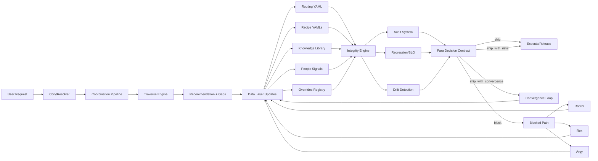
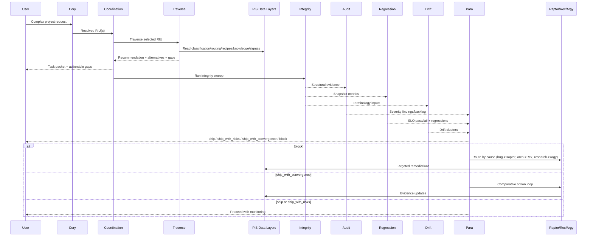
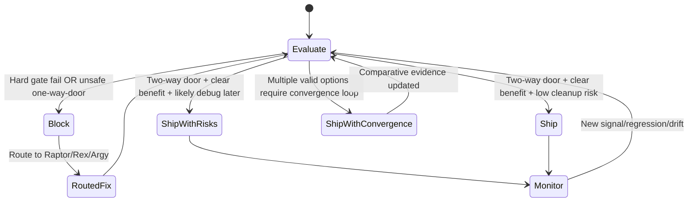

# PIS End-to-End System Graph (Post-Integrity Revision)
Date: 2026-03-02
Diagram language: Mermaid
Reason: portable in-repo, no external renderer dependency required

## 1) System Components and Feedback Loops

## 2) Runtime Sequence for a Complex Dev Project

## 3) Para Decision-State Machine

## 4) Why This Converges

Convergence is maintained by four cooperating controls:
1. Structural truth: `integrity.py`
2. Prioritized risk framing: `audit_system.py`
3. Backslide protection: `regression.py`
4. Semantic consistency pressure: `drift.py`

Para sits above those controls and translates evidence into controlled action:
- Experiment quickly when reversible.
- Force convergence when options are unresolved.
- Block and route when risk is irreversible or failing hard gates.

